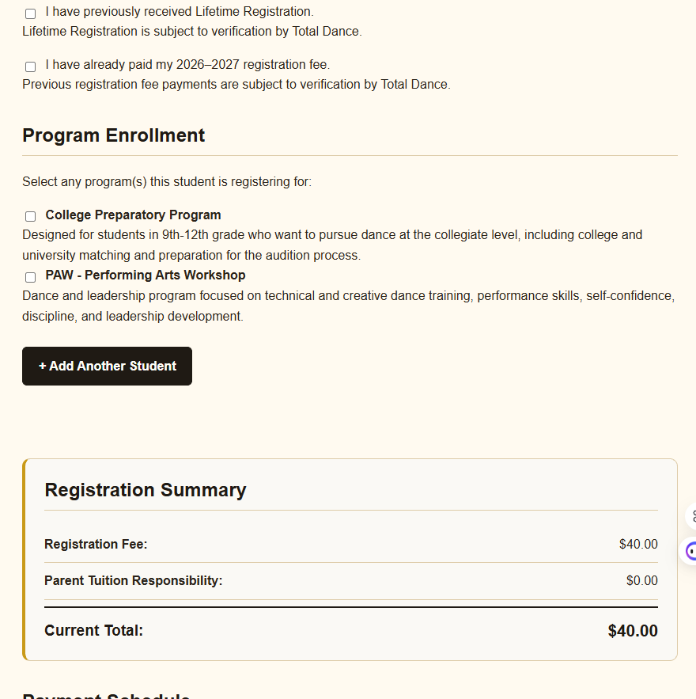
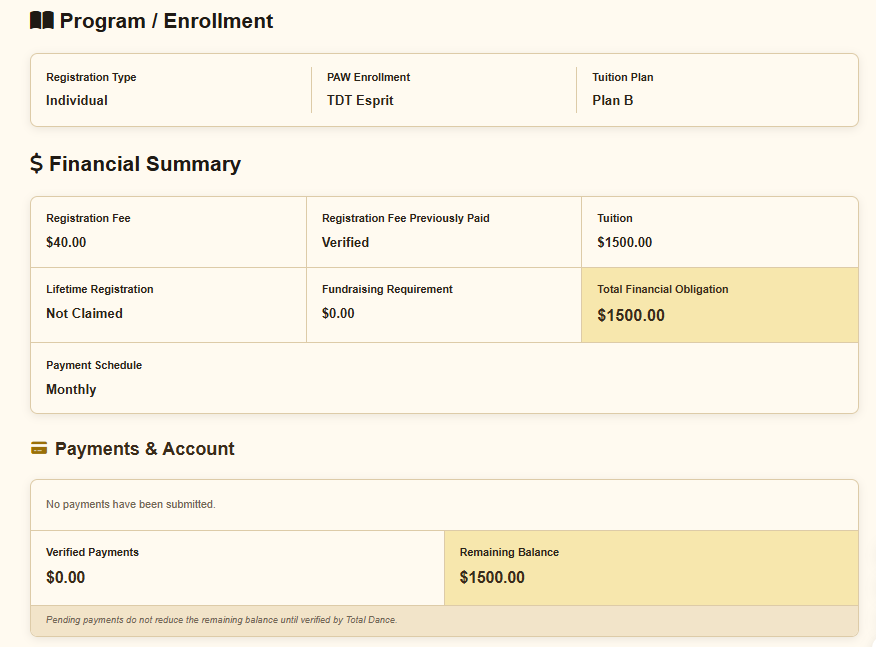
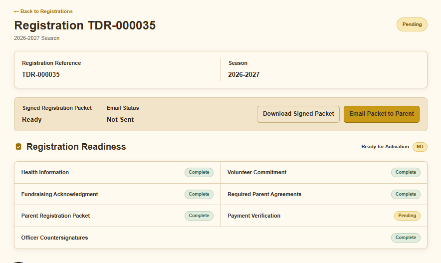
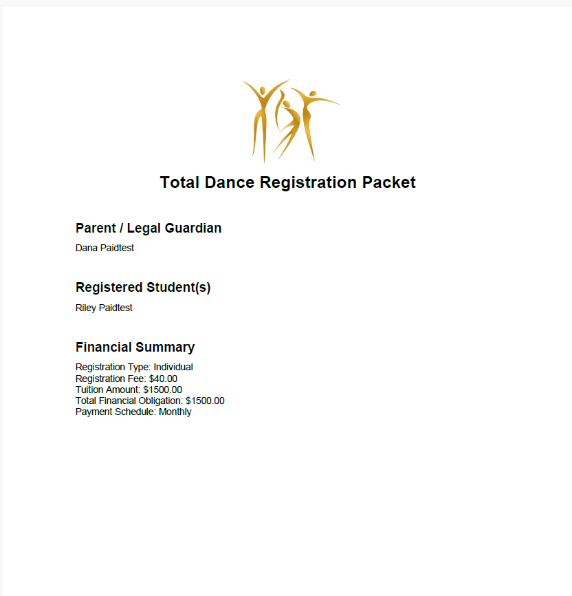
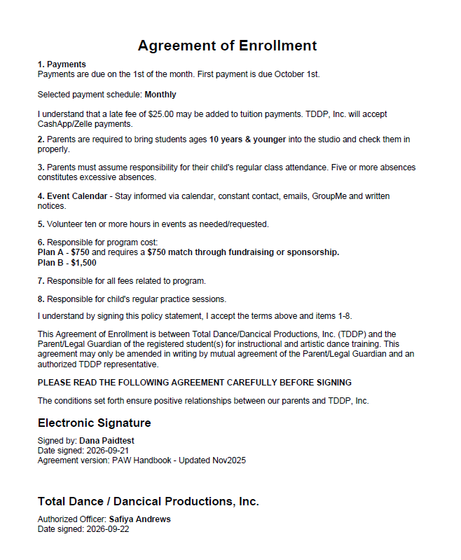

# Total Dance Management System

### Quick Navigation

[Business Problem](#business-problem) •
[Solution](#solution) •
[Technology Stack](#technology-stack) •
[System Architecture](#system-architecture) •
[Core Business Logic & Workflow Automation](#core-business-logic--workflow-automation) •
[Production Engineering & Iterative Development](#production-engineering--iterative-development) •
[My Role](#my-role) •
[Management Platform Roadmap](#management-platform-roadmap) •
[System in Action](#system-in-action)

A production dance registration and administration platform built for Total Dance Development Program / Dancical Productions.

The system was created to replace fragmented registration and administrative processes with a centralized web application that manages student enrollment, family accounts, program selections, financial obligations, agreements, payments, and administrative workflows.

> **Portfolio Case Study:** This repository documents the architecture, development process, and functionality of the system. The production source code and organizational data are maintained in a separate private repository.

## 🎯 Business Problem

The organization needed a registration system capable of handling more than basic student intake. Registration involves family relationships, multiple students, different programs and classes, tuition structures, registration fees, payment schedules, health information, agreements, fundraising requirements, and administrative verification.

The initial system successfully supported live registration. Feedback from real users then revealed additional operational requirements, including multi-student family registration, family-level fees, lifetime registration, previously paid fees, administrative corrections, and improved document delivery.

Those requirements were translated into the next production release and are driving the system's continued development into a broader dance management platform.

## 💡 Solution

I designed and developed a Flask-based web application that translates these operational requirements into structured digital workflows.

The system combines:

- Multi-step online registration
- Multi-student family accounts
- Program and class enrollment
- Automated tuition and registration-fee calculations
- Payment schedule and balance tracking
- Administrative verification workflows
- Health, volunteer, fundraising, and agreement records
- Electronic signatures
- Automated PDF registration packets
- Email confirmation through API integration
- Administrative search, filtering, and record management

## 🛠️ Technology Stack

**Backend:** Python • Flask  
**Database:** SQLite • Relational Database Design • SQL  
**Frontend:** HTML • CSS • JavaScript • Jinja2  
**Automation & Integration:** ReportLab • Email API Integration  
**Development:** Git • GitHub • Virtual Environments  
**Deployment:** PythonAnywhere • Database Migration • Environment Variables & Secrets Management

## 🏗️ System Architecture

The application uses a relational data model designed around families, students, registrations, enrollment, financial activity, and administrative workflows.

### Core Data Areas

**Family & Student Management**
- Family-level records support multiple students within one household
- Individual student demographic and enrollment records
- Parent/guardian and emergency contact information
- Health and medical information

**Registration & Enrollment**
- Registration records tied to students and families
- Program enrollment by individual student
- Class enrollment for applicable tuition plans
- Enrollment agreements and electronic signatures

**Financial Management**
- Registration fees
- Program tuition obligations
- Payment schedules
- Payment history and verification
- Fundraising obligations
- Account balance calculations

**Administrative Workflows**
- Administrative user access
- Payment verification
- Lifetime registration verification
- Previously paid registration-fee verification
- Student record corrections
- Audit history for administrative changes
- Officer countersignatures

### Relational Database Design

The database separates operational data into related entities rather than storing registration information in a single record.

Core entities include:

`families` • `students` • `registrations` • `student_program_enrollments` • `student_class_enrollments` • `payments` • `programs` • `classes` • `health_information` • `volunteer_commitment` • `fundraising_acknowledgment` • `agreements`

This structure allows the system to represent one family with multiple students while maintaining separate enrollment, program, class, and financial information for each student.

## ⚙️ Business Logic & Workflow Automation

The application translates complex registration and financial policies into automated workflows. Business rules are applied dynamically based on family structure, student enrollment, tuition selections, payment history, and administrative verification.

### Financial Logic

- Automatically determines individual or family registration fees
- Calculates tuition based on program, grade level, and enrollment selections
- Supports annual, monthly, quarterly, and full-payment schedules
- Applies payments beyond registration fees toward tuition balances
- Tracks remaining financial obligations
- Supports lifetime registration and previously paid fee scenarios
- Preserves historical payment information when financial records are corrected

### Registration Workflows

- Supports multiple students within a single family registration
- Allows different program and class selections for each student
- Uses conditional form logic to display only relevant enrollment options
- Validates and standardizes student birthdate information
- Captures health, volunteer, fundraising, and agreement information
- Records electronic signatures and agreement timestamps

### Document & Communication Automation

- Generates branded PDF registration packets using ReportLab
- Populates documents with current registration and financial data
- Includes applicable agreements and electronic signatures
- Supports administrative officer countersignatures
- Sends registration confirmation emails through API integration
- Keeps production credentials outside source control through environment configuration

### Administrative Controls

- Provides authenticated administrative access
- Supports registration search and filtering
- Groups multi-student families within administrative workflows
- Allows authorized corrections to student records
- Maintains audit history for administrative changes
- Supports payment and registration-status verification

## 🚀 Production Engineering & Iterative Development

The system is developed using a production-oriented workflow with separate development and deployment environments. Changes are tested locally, version-controlled with Git, and deployed to the live application after validation.

### Development & Deployment

- Manage application development through Git and GitHub
- Use feature development and controlled merges into the main branch
- Maintain separate development and production configurations
- Deploy application updates to PythonAnywhere
- Manage Python dependencies and virtual environments
- Perform database backups before production changes
- Apply schema migrations without recreating the live production database
- Run compilation, import, and end-to-end application checks after deployment
- Store production credentials and API keys outside source control

### Iterative Product Development

The first production release was used during live student registration. Real-world usage exposed requirements that were not fully visible during the initial design process.

User feedback identified the need for:

- Multi-student family registration
- Family-level registration fees
- Lifetime registration handling
- Previously paid registration-fee verification
- Improved birthdate handling
- Administrative record corrections
- Enhanced registration-document delivery

These findings became requirements for the next development cycle.

The application was then migrated from its original single-student registration model to a family-based architecture capable of supporting multiple students while preserving existing production records and financial history.

This development cycle follows a continuous process:

**Business Requirements → Solution Design → Development → Testing → Production Deployment → User Feedback → Enhancement**

## 👩🏽‍💻 My Role

I serve as Treasurer and Co-Director for the organization and designed and developed this system from direct knowledge of its operational and financial workflows.

My responsibilities span requirements analysis, solution design, database architecture, application development, workflow automation, testing, deployment, production support, and ongoing product development.

## 🗺️ Management Platform Roadmap

The registration application is evolving into a broader dance management platform designed to support the organization's financial, administrative, program, production, event, family and development operations throughout the season.

### Financial Management

- Administrative payment entry and payment history
- Family and student account ledgers
- Running account balances
- Fundraising credits applied to student obligations
- Volunteer-hour tracking and applicable account credits
- Balance statements
- Upcoming payment reminders
- Payment integration

### Reporting & Administration

- Administrative financial reports
- Registration and enrollment reports
- Payment and outstanding-balance reports
- Fundraising participation and credit reports
- Volunteer participation reporting
- Exportable operational data

### Family & Student Portal

- Secure family account access
- Student enrollment information
- Account balances and payment history
- Registration documents and agreements
- Fundraising and volunteer activity
- Ability to resume incomplete registration workflows
- Centralized access to relevant program information

### Programs, Events & Productions

- Production and performance management
- Conference participation and event coordination
- Dance workshop registration and scheduling
- Rehearsal and performance scheduling
- Student participation tracking across productions and events
- Event-specific requirements and communications

### Dancewear & Merchandise

- Dancewear and apparel management
- Student sizing and order tracking
- Product and inventory management
- Family order history
- Payment tracking for merchandise purchases

### Sponsorship Management

- Sponsor records and contact management
- Sponsorship levels and commitments
- Payment and contribution tracking
- Production and event sponsorship assignments
- Sponsor recognition and fulfillment tracking

## 🖥️ System in Action

The following examples demonstrate how business requirements move through the system from registration and enrollment to financial management, administrative processing, and automated documentation.

### Administrative Dashboard

The administrative dashboard provides a centralized view of registrations, payment status, registration status, and student records. Search and filtering tools support day-to-day administrative management.

### Dynamic Enrollment & Tuition Logic

The registration workflow uses conditional logic to display enrollment options based on the selections made for each student.

**Initial Program Selection**

Selecting PAW and an applicable tuition plan dynamically reveals additional enrollment options. In the example below, Plan C displays individual class selections and automatically updates the student's financial summary based on the selected classes.

**Dynamic PAW Enrollment**

### Financial & Administrative Management

Enrollment information flows into the administrative system where program selections, tuition obligations, payment schedules, verified payments, and account balances can be managed.

Registration readiness provides administrators with a consolidated view of the requirements that must be completed before a registration can be activated.

### Automated Document Generation

Registration data is transformed into a generated PDF packet containing student and financial information, applicable agreements, and registration documentation.

The agreement workflow records electronic signatures and supports separate authorized-officer countersignatures.

